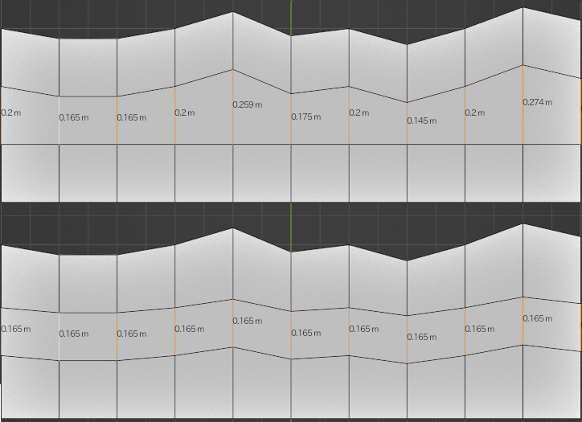

# Equalize Edge
This addon makes the selected edges same length. The length criterion is the active edge.

※ use only edge ring selection.

Problem
---
- Select scale orientation
- Usable on UV editor
